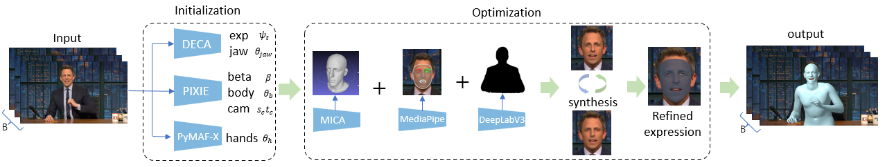

# SHOW: Synchronous HOlistic body in the Wild
<b>[CVPR2023] Generating Holistic 3D Human Motion from Speech</b>

[[Project Page](https://talkshow.is.tue.mpg.de)] [[Arxiv](https://export.arxiv.org/abs/2212.04420)] [[Colab](https://colab.research.google.com/drive/1ZGuRX-m_2xEZ2JGGpvyePTLDBPKFd41I?usp=sharing)]

<p align="center"> 

</p>

This repository provides the official implementation of SHOW(Synchronous HOlistic body in the Wild). Given rgb images or videos only, SHOW can reconstruct holistic whole body mesh results. Please refer to the [arXiv paper](https://export.arxiv.org/abs/2212.04420) for more details.


**What you can use**:

* **easy and efficient:** adapts SMPLify-X to the videos of
talking persons with several good practices.
* **state-of-art:** Compared to other methods, ours produces more accurate and stable results with details.

<p align="center"> 

</p>

## Getting Started

Take a quick tour on colab: [[Colab]](https://colab.research.google.com/drive/1ZGuRX-m_2xEZ2JGGpvyePTLDBPKFd41I?usp=sharing). 

<!-- Alternatively, you can directly run the [ipynb file](SHOW_demo.ipynb) in the Jupyter environment. -->

### Installation

To install SHOW, please execute `pip install git+https://github.com/yhw-yhw/SHOW.git` or

```bash
git clone https://github.com/yhw-yhw/SHOW.git
cd SHOW && pip install -v -e .
```

### Preliminary

- [environment] Using virtual environment by runing

  ```bash
  bash install_conda.sh
  conda create -n env_SHOW python=3.9
  eval "$(conda shell.bash hook)"
  conda activate env_SHOW
  ```

  install pytorch using `pip3 install torch torchvision torchaudio --extra-index-url https://download.pytorch.org/whl/cu116` or

  ```bash
  conda install pytorch torchvision torchaudio pytorch-cuda=11.6 -c pytorch -c nvidia
  ```

  You can run

  ```bash
  cd SHOW/modules/MICA && pip install -r requirements.txt
  cd SHOW/modules/PIXIE && pip install -r requirements.txt
  cd SHOW/modules/PyMAF && pip install -r requirements.txt
  cd SHOW/modules/DECA && pip install -r requirements.txt
  cd SHOW && pip install -r requirements.txt
  ```

  Note that Pytorch3D may require manuall installation (see instructions [here](https://github.com/facebookresearch/pytorch3d/blob/main/INSTALL.md)).

- [models] download packed model files, and put it in the same level directory as SHOW
  
  ```bash
  wget https://www.dropbox.com/s/gqdcu51ilo44k3i/models.zip?dl=0 -O models.zip
  wget https://www.dropbox.com/s/r14bl9mhvngohla/data.zip?dl=0 -O data.zip
  unzip data.zip
  7za x models.zip
  ```

- [OpenPose]: follow the code from [OpenPose Colab notebook](https://colab.research.google.com/github/tugstugi/dl-colab-notebooks/blob/master/notebooks/OpenPose.ipynb, and change OpenPose bin path `openpose_root_path` and `openpose_bin_path` in `configs\configs\machine_cfg.py`.

- [MMPose]: Make sure to install mmcv-full, and set env variable `mmpose_root`

  ```bash
  pip install openmim
  mim install mmcv-full
  git clone https://github.com/open-mmlab/mmdetection
  cd /content/mmdetection && python setup.py install
  git clone https://github.com/open-mmlab/mmpose
  export mmpose_root = $mmpose_root$
  ```

- models for `inisghtface`:
  1) [antelopev2](https://keeper.mpdl.mpg.de/f/2d58b7fed5a74cb5be83/?dl=1)
  2) [buffalo_l](https://keeper.mpdl.mpg.de/f/8faabd353cfc457fa5c5/?dl=1)

  use the following command as reference

  ```bash
  mkdir -p ~/.insightface/models
  cd ~/.insightface/models
  wget https://keeper.mpdl.mpg.de/f/2d58b7fed5a74cb5be83/?dl=1 -O antelopev2.zip
  wget https://keeper.mpdl.mpg.de/f/8faabd353cfc457fa5c5/?dl=1 -O buffalo_l.zip
  mkdir -p antelopev2 && cd antelopev2 && unzip -o ../antelopev2.zip
  mkdir -p buffalo_l && cd buffalo_l && unzip -o ../buffalo_l.zip
  ```

  
- [others] `pip uninstall -y xtcocotools && pip install xtcocotools --no-binary xtcocotools`
  
### Run

Run SHOW on demo video

```bash
python main.py --speaker_name -1 --all_top_dir ./test/demo_video/half.mp4
```

It takes 15-20 minutes for 5s 30 FPS video on Colab Tesla T4.

The final results are stored in `./test/demo_video/ours_exp`. All the smplx variables can be found in `./test/demo_video/ours_exp/final_all.pkl`, and the visualization can be viewed in `./test/demo_video/ours_exp/final_vis.mp4`.

## Datasets

### Download Dataset Videos

Download all videos from youtube, please refer to (https://github.com/amirbar/speech2gesture), or using the following script: ```download_youtube.py```, remember to install `yt-dlp`. After downloading all videos, you can using  `SHOW_intervals_subject4.csv` for video interval cropping.

### Visualize Dataset

After running SHOW, we will get processed data in a pkl file. Here we can visualize pkl from our provided dataset.

```bash
python render_pkl_release.py \
--pkl_file_path test/demo_pkl/all.pkl \
--out_images_path test/demo_pkl/ours_images \
--output_video_path test/demo_pkl/ours.mp4 \
--smplx_model_path ../models/smplx/SMPLX_NEUTRAL_2020_org.npz
```

### Download Links

The data reconstructed by SHOW is released, you can download it

- [[Dropbox]](https://www.dropbox.com/sh/f1gu531w5s2sbqd/AAA2I7oLolEkcXnWI6tnwUpAa?dl=0)

<!-- Larger datasets will be released later -->

### Dataset Description

- speaker=oliver/chemistry/conan/seth
- The maximum length of video clip is 10s with 30 fps
- Format of files in the compressed package:
  - `{speaker}_wav_tar.tar.gz`:
    - The path format of each file is: `speaker/video_fn/seq_fn.wav`
    - Audio obtained from the original video at 22k sampling rate
  - `{speaker}_pkl_tar.tar.gz`:
    - The path format of each file is: `speaker/video_fn/seq_fn.pkl`
    - Data contained in the pkl file:

    ```bash
    width，height: the video width and height
    center: the center point of the video
    batch_size: the sequence length
    camera_transl: the displacement of the camera
    focal_length: the pixel focal length of a camera
    body_pose_axis: (bs, 21, 3)
    expression: (bs, 100)
    jaw_pose: (bs,3)
    betas: (300)
    global_orient: (bs,3)
    transl: (bs,3)
    left_hand_pose: (bs,12)
    right_hand_pose: (bs,12)
    leye_pose: (bs,3)
    reye_pose: (bs,3)
    pose_embedding: (bs,32)
    ```
  
    - Set the config of smplx model as follows:
  
    ```python
      smplx_cfg=dict(
          model_path='path_to_smplx_model'
          model_type= 'smplx',
          gender= 'neutral',
          use_face_contour= True,
          use_pca= True,
          flat_hand_mean= False,
          use_hands= True,
          use_face= True,
          num_pca_comps= 12,
          num_betas= 300,
          num_expression_coeffs= 100,
      )
    ```

- In practice, global orient and transl parameters should be fixed as the first frame and the lower part of the body pose should be fixed as sitting or standing position: [code](post_process.py)

## Citation

If you use this project in your research please cite this paper:
```
@inproceedings{yi2022generating,
  title={Generating Holistic 3D Human Motion from Speech},
  author={Yi, Hongwei and Liang, Hualin and Liu, Yifei and Cao, Qiong and Wen, Yandong and Bolkart, Timo and Tao, Dacheng and Black, Michael J},
  booktitle={CVPR},
  year={2023}
}
```

## Issues 

 - If following error is encountered
   ```
     RuntimeError: Subtraction, the `-` operator, with a bool tensor is not supported. If you are trying to invert a mask, use the `~` or `logical_not()` operator instead.
   ```
   
   Open torchgeometry/core/conversions.py file and replace line 304-306 with
   
   ```
    mask_c1 = mask_d2 * (~ mask_d0_d1)
    mask_c2 = (~ mask_d2) * mask_d0_nd1
    mask_c3 = (~ mask_d2) * (~ mask_d0_nd1)
   ```

## License

This code and model are available for non-commercial scientific research purposes as defined in the [LICENSE](LICENSE) file.
By downloading and using the code and model you agree to the terms in the [LICENSE](LICENSE).

## Acknowledgements

For functions or scripts that are based on external sources, we acknowledge the origin individually in each file. We specifically thanks [WOJCIECH ZIELONKA](https://zielon.github.io/) and [Justus Thies](https://justusthies.github.io/) for sharing their face tracking codebase.

Here are some great resources we benefit: 
 
- [SMPLify-X](https://smpl-x.is.tue.mpg.de/)
- [DECA](https://github.com/YadiraF/DECA) for face expression initialization
- [PIXIE](https://pixie.is.tue.mpg.de/) and [PyMAF-X](https://github.com/HongwenZhang/PyMAF-X) for SMPL-X parameters initialization
- [DeepLab](https://github.com/leimao/DeepLab-V3) for person segmentation
- [MICA](https://github.com/Zielon/MICA) and [https://github.com/HavenFeng/photometric_optimization] for face tracking
- [Pytorch3D](https://pytorch3d.org/) for rendering  
- [FAN](https://github.com/1adrianb/2D-and-3D-face-alignment) for landmark detection
- [arcface-pytorch](https://github.com/ronghuaiyang/arcface-pytorch)
  
## Contact

For questions, please contact talkshow@tue.mpg.de or [hongwei.yi@tuebingen.mpg.de](mailto:hongwei.yi@tuebingen.mpg.de) or [fthualinliang@mail.scut.edu.cn](mailto:fthualinliang@mail.scut.edu.cn).

For commercial licensing, please contact ps-licensing@tue.mpg.de
