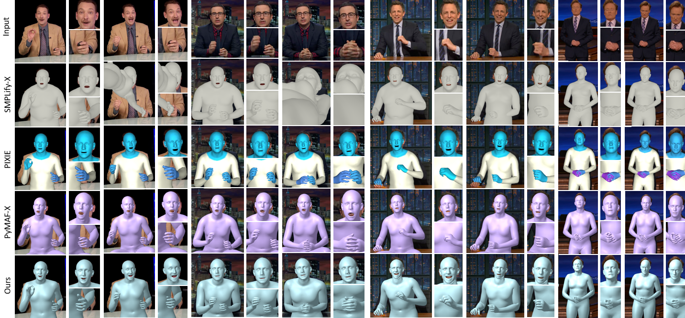

# SHOW: Synchronous HOlistic body in the Wild
<b>Generating Holistic 3D Human Motion from Speech</b>

[[Project Page](https://talkshow.is.tue.mpg.de)] [[Arxiv](export.arxiv.org/abs/2212.04420)] [[Colab](https://colab.research.google.com/drive/1ZGuRX-m_2xEZ2JGGpvyePTLDBPKFd41I?usp=sharing)]

<p align="center"> 

</p>

<!--  -->

This repository provides the official implementation of SHOW(Synchronous HOlistic body in the Wild). Given rgb images or videos only, SHOW can reconstruct holistic whole body mesh results. Please refer to the [arXiv paper](export.arxiv.org/abs/2212.04420) for more details.


**What you can use**:

* **easy and efficient:** adapts SMPLify-X to the videos of
talking persons with several good practices.
* **state-of-art:** Compared to other methods, ours produces more accurate and stable results with details.

<!--  -->
<!-- - [ ] demo video -->

## Getting Started

### Installation

To install SHOW, please execute:

```bash
pip install git+https://github.com/yhw-yhw/SHOW.git
cd SHOW && pip install -v -e .
```

### Requirements

* Python 3.7 (numpy, skimage, scipy, opencv)  
* PyTorch >= 1.6 (pytorch3d) 
  
Note that Pytorch3D may require manuall installation (see instructions [here](https://github.com/facebookresearch/pytorch3d/blob/main/INSTALL.md)).

You can run 

```bash
pip install -r requirements.txt
pip install -r tools/env/req_parts/t0.txt
pip install -r tools/env/req_parts/t1.txt
pip install -r tools/env/req_parts/t2.txt
pip install -r tools/env/req_parts/t3.txt
pip install -r tools/env/req_parts/t4.txt
```

Or use virtual environment by runing 

```bash
bash install_conda.sh
conda create -n env_SHOW python=3.9
eval "$(conda shell.bash hook)"
conda activate env_SHOW
```

install pytorch using

```bash
conda install pytorch==1.2.0 torchvision==0.4.0 cudatoolkit=10.0 -c pytorch
```

or just install the environment by using attached conda `environment.yml` file with the command 
``conda env create -f environment.yml``.

### Preliminary

- [ ] download_models.sh

- [MMPose]: clone git repo, and set env

  ```bash
  git clone https://github.com/open-mmlab/mmpose
  export mmpose_root = $mmpose_root$
  ```

- [MICA]: you can find the pretrained model in (https://github.com/Zielon/MICA)
  - install python lib for MICA:
  
    ```bash
    cd modules/MICA
    pip install -r req.txt
    ```
- [PIXIE]: follow the installation instruction in (modules/PIXIE/README.md)
  - install python lib for MICA:

    ```bash
    cd modules/PIXIE
    pip install -r requirements.txt
    ```

- models for `inisghtface`:
  1) [antelopev2](https://keeper.mpdl.mpg.de/f/2d58b7fed5a74cb5be83/?dl=1)
  2) [buffalo_l](https://keeper.mpdl.mpg.de/f/8faabd353cfc457fa5c5/?dl=1)

### Run

running SHOW on demo video

```bash
python main.py --speaker_name -1 --all_top_dir ./test/half.mp4
```

## Datasets
  

### Dataset Videos Download

#### Prerequisits for data download

download all videos from `TODO` or youtube, please refer to (https://github.com/amirbar/speech2gesture), or using the following script: ```tools\datasets\download_youtube.py```, remember to install `yt-dlp`. using  `tools\datasets\SHOW_intervals_subject4.csv` for video interval cropping.


### Visualize Dataset

After running SHOW, we will get processed data in a pkl file. Here we can visualize pkl from our provided dataset.

```bash
python render_pkl_release.py \
--pkl_file_path test/all.pkl \
--out_images_path test/ours_images \
--output_video_path test/ours.mp4 \
--smplx_model_path models/smplx/SMPLX_NEUTRAL_2020_org.npz
```

### Download Links

- [[Dropbox]](https://www.dropbox.com/sh/f1gu531w5s2sbqd/AAA2I7oLolEkcXnWI6tnwUpAa?dl=0)]
- [[Google Drive]](TODO)

### Dataset Description

- speaker=oliver/chemistry/conan/seth
- The maximum length of video clip is 10s with 30 fps
- Format of files in the compressed package:
  - `{speaker}_wav_tar.tar.gz`:
    - The path format of each file is: `speaker/video_fn/seq_fn.wav`
    - Audio obtained from the original video at 22k sampling rate
  - `{speaker}_pkl_tar.tar.gz`:
    - The path format of each file is: `speaker/video_fn/seq_fn.pkl`
    - Data contained in the pkl file:
      - width，height: the video width and height
      - center: the center point of the video
      - batch_size: the sequence length
      - camera_transl: the displacement of the camera
      - focal_length: the pixel focal length of a camera
      - body_pose_axis: (bs, 21, 3)
      - expression: (bs, 100)
      - jaw_pose: (bs,3)
      - betas: (300)
      - global_orient: (bs,3)
      - transl: (bs,3)
      - left_hand_pose: (bs,12)
      - right_hand_pose: (bs,12)
      - leye_pose: (bs,3)
      - reye_pose: (bs,3)
      - pose_embedding: (bs,32)
  
    - Set the config of smplx model as follows:
  
    ```python
      smplx_cfg=dict(
          model_path='path_to_smplx_model'
          model_type= 'smplx',
          gender= 'neutral',
          use_face_contour= True,
          use_pca= True,
          flat_hand_mean= False,
          use_hands= True,
          use_face= True,
          num_pca_comps= 12,
          num_betas= 300,
          num_expression_coeffs= 100,
      )
    ```

- In practice, global orient and transl parameters should be fixed as the first frame and the lower part of the body pose should be fixed as sitting or standing position: [code](post_process.py)


<!-- ## Code Structure

this code `main.py` does the following things:

- crop intervals from videos
- prepare data from PIXIE、DECA、Openpose、PyMAF-X、FAN, etc.
- do smplifyx optimazation
- refine facial expression -->

## Citation

If you use this project in your research please cite SHOW:
```
@misc{yi2022generating,
    title={Generating Holistic 3D Human Motion from Speech},
    author={Hongwei Yi and Hualin Liang and Yifei Liu and Qiong Cao and Yandong Wen and Timo Bolkart and Dacheng Tao and Michael J. Black},
    year={2022},
    eprint={2212.04420},
    archivePrefix={arXiv},
    primaryClass={cs.CV}
}
```

## Issues 

 - If following error is encountered
   ```
     RuntimeError: Subtraction, the `-` operator, with a bool tensor is not supported. If you are trying to invert a mask, use the `~` or `logical_not()` operator instead.
   ```
   
   Open torchgeometry/core/conversions.py file and replace line 304-306 with
   
   ```
    mask_c1 = mask_d2 * (~ mask_d0_d1)
    mask_c2 = (~ mask_d2) * mask_d0_nd1
    mask_c3 = (~ mask_d2) * (~ mask_d0_nd1)
   ```

## License

This code and model are available for non-commercial scientific research purposes as defined in the [LICENSE](LICENSE) file.
By downloading and using the code and model you agree to the terms in the [LICENSE](LICENSE). 

## Acknowledgements

For functions or scripts that are based on external sources, we acknowledge the origin individually in each file. We specifically thanks [WOJCIECH ZIELONKA](https://zielon.github.io/) and [Justus Thies](https://justusthies.github.io/)for sharing their face tracking codebase.

Here are some great resources we benefit: 
 
- [DECA](https://github.com/YadiraF/DECA) for face expression initialization
- [PIXIE](https://pixie.is.tue.mpg.de/) and [PyMAF-X](https://github.com/HongwenZhang/PyMAF-X) for SMPL-X parameters initialization
- [DeepLab](https://github.com/leimao/DeepLab-V3) for person segmentation
- [MICA](https://github.com/Zielon/MICA) and [https://github.com/HavenFeng/photometric_optimization] for face tracking
- [Pytorch3D](https://pytorch3d.org/) for rendering  
- [FAN](https://github.com/1adrianb/2D-and-3D-face-alignment) for landmark detection
<!-- - [mediapipe](https://github.com/google/mediapipe) -->
<!-- - [FLAME](https://flame.is.tue.mpg.de/) -->
  
## Contact

For questions, please contact talkshow@tue.mpg.de or [hongwei.yi@tuebingen.mpg.de](mailto:hongwei.yi@tuebingen.mpg.de) or [fthualinliang@mail.scut.edu.cn](mailto:fthualinliang@mail.scut.edu.cn).`

For commercial licensing, please contact ps-licensing@tue.mpg.de
